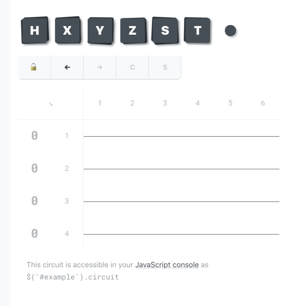

  

Quantum, made easy
==============================================================================

Q is a quantum circuit simulator, drag-and-drop circuit editor, and powerful 
JavaScript library that runs right here in your web browser. There’s nothing 
to install and nothing to configure, so jump right in and experiment! 
Fire up the [Q editor](https://quantumjavascript.app), then tap and drag the 
pieces around to get a feel for how it works. It’s easy to use on both 
desktop and mobile devices. Made a mistake? Just tap the Undo button.

  
  
  
Free and open-source
------------------------------------------------------------------------------
Q is free to use, our code is open-source, and our API is heavily documented. 
Still a quantum novice? Each page of API documentation includes simple 
explanations of basic quantum concepts to get you up to speed quickly. This 
makes Q ideal for the classroom as well as autodidacts at home. Q just might 
be the most accessible quantum circuit suite in the world. Join our project 
on GitHub at
[https://github.com/stewdio/q.js](https://github.com/stewdio/q.js)
and drop a link to Q’s website
[https://quantumjavascript.app](https://quantumjavascript.app)
on social media with the hashtag 
[#Qjs](https://twitter.com/search?q=%23Qjs).
Let’s make quantum computing accesible!


Quantum JavaScript
==============================================================================
What does coding a quantum circuit look like in JavaScript? Let’s create a 
[Bell state](https://en.wikipedia.org/wiki/Bell_state)
example together using Q. First, we’ll create a circuit that uses 2 qubits for
2 moments of time. Then, let’s place a 
[Hadamard](https://quantumjavascript.app/Q-Gate.html#.HADAMARD) gate at 
moment 1 on register 1. Finally, we’ll place a 
[Controlled-Not](https://quantumjavascript.app/Q-Gate.html#.PAULI_X) gate
at moment 2, with the control component on register 1 and the target 
component on register 2. For fun we’ll give our circuit a random name and 
generate an outcome probabilities report. (And 
[what are those dollar signs about?](https://quantumjavascript.app/contributing.html#Destructive_vs_non-destructive_methods))
```javascript
new Q.Circuit( 2, 2 )
    .set$( Q.Gate.HADAMARD, 1, 1 )
    .set$( Q.Gate.PAULI_X, 2, [ 1, 2 ])
    .setName$( Q.getRandomName$ )
    .evaluate$()
```


Shorthand syntax
------------------------------------------------------------------------------
As your circuits become longer and more complex, typing out all those 
[set$](https://quantumjavascript.app/Q-Circuit.html#.set$) commands can 
become cumbersome—and difficult to read. That’s why we built 
[Q’s shorthand syntax](https://quantumjavascript.app/Q-Circuit.html#.fromText). 
Just type your circuit operations out as text (using “I” for 
[identity gates](https://quantumjavascript.app/Q-Gate.html#.IDENTITY) in the 
spots where no operations occur), enclose your text block in backticks 
(instead of quotes) and you’re good to go! This code snippet below does 
exactly the same thing as the snippet above. (To learn more about 
[Q’s shorthand syntax](https://quantumjavascript.app/Q-Circuit.html#.fromText) 
and other convenient tricks, see 
[“Writing quantum circuits.”](https://quantumjavascript.app/Q-Circuit.html#Writing_quantum_circuits)

```javascript
Q`
    H  X#0
    I  X#1
`
.setName$( Q.getRandomName$ )
.evaluate$()
```


Clear, legible output
------------------------------------------------------------------------------
Whether you use Q’s circuit editor,
[shorthand syntax](https://quantumjavascript.app/Q-Circuit.html#.fromText),
or prefer to type out every 
[set$](https://quantumjavascript.app/Q-Circuit.html#.set$) command yourself,
Q makes inspecting and evaluating your circuits easy. Here’s the output 
generated by the code above:

```
Beginning evaluation for “Red kangaroo”

         m1    m2   
        ┌───┐╭─────╮
r1  |0⟩─┤ H ├┤ X#0 │
        └───┘╰──┬──╯
             ╭──┴──╮
r2  |0⟩───○──┤ X#1 │
             ╰─────╯

██████████░░░░░░░░░░  50%   1 of 2
████████████████████ 100%   2 of 2


Evaluation completed for “Red kangaroo”
with these results:

1  |00⟩  ██████████░░░░░░░░░░  50% chance
2  |01⟩  ░░░░░░░░░░░░░░░░░░░░   0% chance
3  |10⟩  ░░░░░░░░░░░░░░░░░░░░   0% chance
4  |11⟩  ██████████░░░░░░░░░░  50% chance

```


Import and export
==============================================================================
Q plays well with everyone. Export your circuits as 
[plain text](https://quantumjavascript.app/Q-Circuit.html#.toText), 
[ASCII diagrams](https://quantumjavascript.app/Q-Circuit.html#.toDiagram), 
[interactive graphic-user-interfaces](https://quantumjavascript.app/Q-Circuit.html#.toDom),
[LaTeX code](https://quantumjavascript.app/Q-Circuit.html#.toLatex),
and more!
Visit the [Q playground](https://quantumjavascript.app/playground.html)
to experiment with converting circuits between various formats.
As always, new features are in the works.
[Join our project on GitHub](https://github.com/stewdio/q.js")
and help us build bridges to everywhere.
  
  
  
  
Give Q a try right now at 
[https://quantumjavascript.app](https://quantumjavascript.app).


